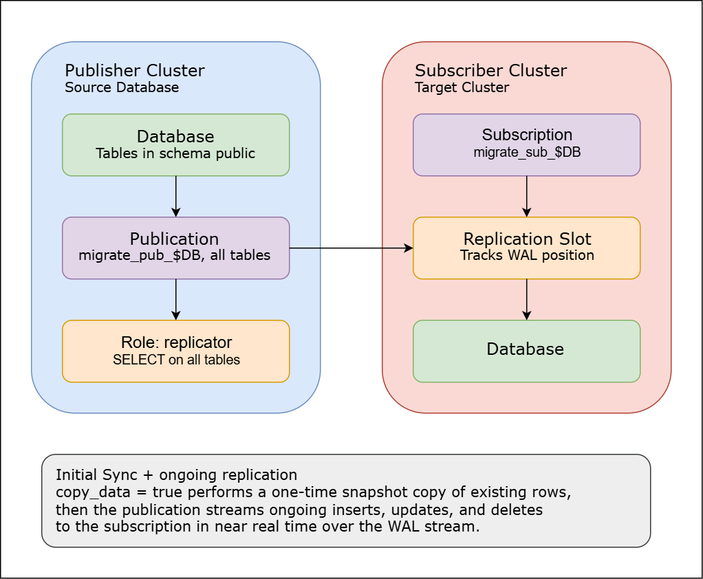

# PostgreSQL Logical Replication — Publication/Subscription Migration

A bash-automated setup for migrating/replicating data between two independent PostgreSQL clusters using `logical replication` (publication + subscription model), instead of physical/streaming (WAL-based binary) replication.

### Why Logical Replication

| Physical Replication | Logical Replication |
|---|---|
| Replicates entire cluster (byte-for-byte WAL) | Replicates at the table/database level |
| Same PostgreSQL major version required | Cross-version compatible |
| Replica is read-only, whole instance | Subscriber DB stays writable, granular |
| Good for HA / failover | Good for migrations, zero-downtime cutovers, selective sync |

This project uses logical replication because the goal was selective, online migration of a database from one cluster (Publisher) to another (Subscriber) without taking the source down.

### Architecture




### Prerequisites

On the Publisher and Subscriber `postgresql.conf` must have:
```
max_connections: <max-connection-numbers>
wal_level: <wal-level-name>
max_replication_slots: <total-replication-slots>
max_wal_senders: <total-wal-senders>
max_worker_processes: <total-worker-processes>
max_logical_replication_workers: <total-logical-replication-workers>
max_sync_workers_per_subscription: <subscription-per-worker>
wal_keep_size: <wal-keep-size>
max_wal_size: <max-wal-size>
```

### Migration Steps

__Configuration:__

__Enable Replication:__

__Replication Status:__

__Disable Replication:__

### Verification Commands

- On the publisher, Check the status of replication slots.
  ```
  SELECT slot_name,plugin,slot_type,database,temporary,active,wal_status,safe_wal_size,two_phase FROM pg_replication_slots;
  ```

- On the subscriber, Check the status of replication workers.
  ```
  SELECT datname,pid,backend_type,application_name,state,wait_event_type,wait_event,query FROM pg_stat_activity WHERE backend_type IN ('logical replication apply worker','logical replication tablesync worker') ORDER BY datname, backend_type, pid;
  ```

- On the subscriber, Check the number of replication workers.
  ```
  SELECT datname,COUNT(*) AS worker_count FROM pg_stat_activity WHERE backend_type LIKE 'logical replication%worker' GROUP BY datname ORDER BY datname;
  ```
